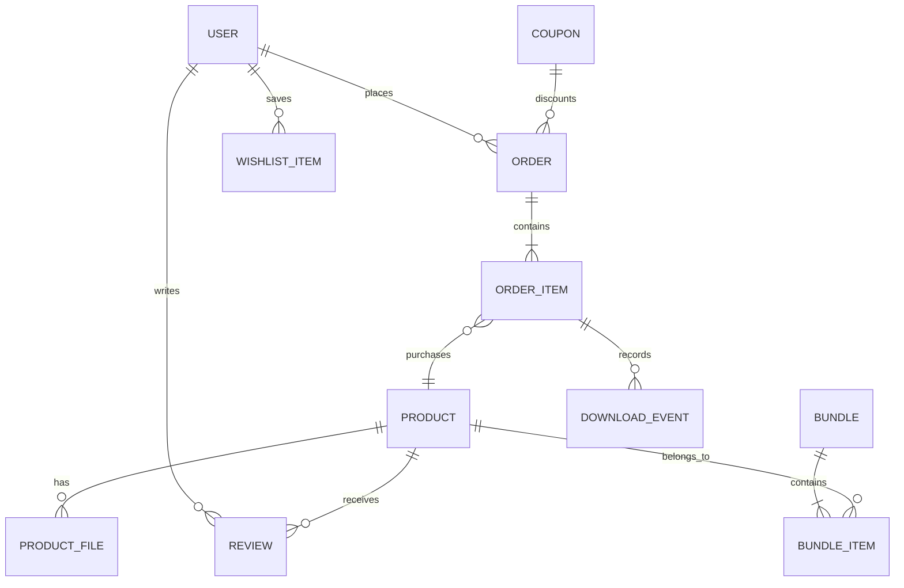
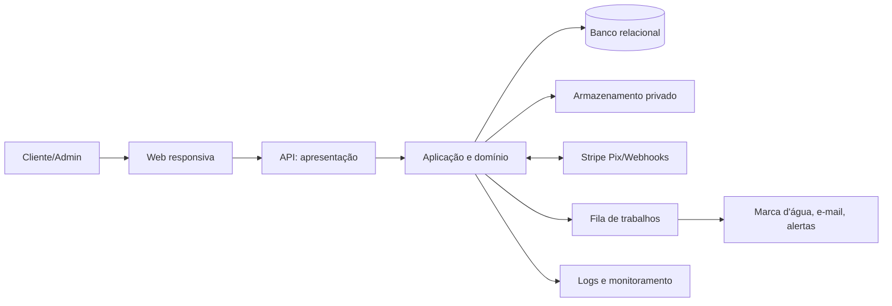

# Lumina Livros

**Versão planejada:** 1.0  

**Status:** PLANEJAMENTO APROVADO

**Chat:** [Planejar plataforma Lumina Livros](https://chatgpt.com/s/cx_6ab04bd630508191b9eca4bb76bda9cd)

## Visão

Lumina Livros é uma aplicação web responsiva de comércio de e-books para o mercado brasileiro. Ela centraliza descoberta, aquisição e entrega segura de obras digitais ao leitor e oferece à equipe administrativa a operação do catálogo, preços, cupons, vendas, clientes e moderação.

O problema tratado é a ausência de uma experiência integrada para encontrar títulos, organizar desejos, comprar e receber e-books, somada à falta de gestão centralizada de catálogo e vendas. A V1 prioriza o fluxo confiável de venda digital com Pix, pré-vendas e conteúdo já adquirido preservado na biblioteca.

## Escopo da V1

- Contas de cliente com confirmação de e-mail, recuperação de senha, maioridade, CPF único e aceite de termos.
- Catálogo de e-books, busca e filtros por título, autor, categoria, idioma, faixa de preço, mais vendidos, bem avaliados e lançamento.
- Produtos gratuitos, e-books pagos, pré-vendas e bundles.
- Carrinho, cupom, Pix via Stripe, pedidos e confirmação idempotente por webhook.
- Biblioteca, downloads ilimitados de PDF/EPUB adquiridos e marca d'água por comprador.
- Wishlist e alertas de promoção, mudança de preço e disponibilidade de pré-venda.
- Avaliações de 1 a 5, comentário opcional, denúncia e moderação.
- Painel: catálogo, importação CSV transacional, preços, cupons, avaliações, clientes, pedidos, reembolsos e indicadores mensais/personalizados.
- Auditoria de preço, catálogo, compras, reembolsos e moderação; logs de erro, monitoramento e alertas de falha de webhook; backups semanais.

## Fora de escopo

- Livros físicos, entrega, rastreio e estoque físico.
- Assinaturas, aluguel, DRM completo, leitura no navegador e status de leitura.
- Cartão, boleto, parcelamento e emissão fiscal.
- Relatórios exportáveis/avançados e 2FA.

## Stakeholders e atores

| Ator | Objetivo e permissões |
|---|---|
| Cliente | Descobrir obras, manter wishlist, comprar, baixar, avaliar, denunciar e gerir sua conta. |
| Gestor de catálogo | Criar, editar, publicar/inativar catálogo, preços e cupons; importar CSV e moderar avaliações. |
| Administrador geral | Todas as permissões do gestor, indicadores, pedidos, reembolsos, clientes, contas administrativas e acompanhamento de exclusão. Deve sempre existir ao menos um ativo. |
| Stripe | Cria e confirma pagamentos Pix via webhook. |
| Serviço de e-mail | Entrega mensagens transacionais e alertas ao cliente. |

## Requisitos funcionais

| ID | Requisito | Prioridade | Critérios de aceitação resumidos |
|---|---|---|---|
| RF-001 | Cadastro e acesso | MUST | Exige nome, CPF único/imutável, telefone, nascimento, e-mail e senha; confirmação de e-mail, recuperação de senha e alteração permitida de nome, telefone e e-mail. |
| RF-002 | Elegibilidade de compra | MUST | Somente conta confirmada, maior de 18 anos, ativa e com termos aceitos compra, inclusive item gratuito. |
| RF-003 | Catálogo e descoberta | MUST | Exibe produtos publicados/ativos e permite filtros especificados e paginação. |
| RF-004 | Wishlist e alertas | SHOULD | Cliente adiciona/remove itens e recebe alertas de promoção, preço e disponibilidade. |
| RF-005 | Carrinho, cupom e pedido | MUST | Carrinho aceita itens pagos/gratuitos; cupom percentual ou fixo aplica-se apenas a itens pagos/bundles, com validade e limite de uso. |
| RF-006 | Pagamento Pix | MUST | Cria Pix Stripe; reserva licença por 24h; webhook validado/idempotente muda pagamento e dispara comunicações. |
| RF-007 | Pré-venda e licença | MUST | Cobrança é imediata; pré-venda libera na data definida; licença é consumida na confirmação, impede venda quando esgotada e retorna em reembolso se ativo. |
| RF-008 | Biblioteca e download | MUST | Libera por item; permite todos os formatos disponíveis, downloads ilimitados e registra o clique de geração do link. |
| RF-009 | Personalização de arquivo | MUST | PDF e EPUB entregues carregam nome, IDs de cliente/pedido e data como marca d'água semivisível. |
| RF-010 | Bundles | MUST | Bundle possui preço/capa próprios, itens cadastrados, não pode duplicar conjunto exato e libera livros separadamente; desconto proporcional a itens já possuídos. |
| RF-011 | Avaliações e moderação | SHOULD | Só comprador avalia 1–5 com comentário opcional; autenticado denuncia; gestor/admin oculta e consulta conteúdo moderado. |
| RF-012 | Administração de catálogo | MUST | Gestor/admin cadastra, importa CSV atomicamente, edita, publica, inativa livros, preços e cupons. |
| RF-013 | Administração operacional | MUST | Admin gere contas, bloqueios, pedidos, reembolsos por item, indicadores e exclusões. |
| RF-014 | Notificações | MUST | Envia e-mails de conta, compra/status, recuperação, alteração de conta, atualização de livro e exclusão. |
| RF-015 | Privacidade e exclusão | MUST | Solicitação desativa conta; permite reativação até prazo legal; notifica antes/depois da exclusão e permite acompanhamento administrativo. |

## Requisitos não funcionais

| ID | Requisito verificável |
|---|---|
| RNF-001 | Interface responsiva nos navegadores modernos de desktop e mobile; suporte exato será definido antes de produção. |
| RNF-002 | Fluxos críticos atendem WCAG 2.1 nível A, incluindo teclado, foco, rótulos e contraste aplicável. |
| RNF-003 | Páginas e operações usuais devem concluir em até 20 s sob carga normal; metas mais rigorosas são decisão posterior. |
| RNF-004 | Senhas são armazenadas com hash forte; dados em trânsito usam TLS; segredos ficam fora do repositório. |
| RNF-005 | Webhooks Stripe têm assinatura validada, persistência idempotente e rastreabilidade de reprocessamento. |
| RNF-006 | Backups são semanais; procedimento e teste de restauração são pendências de infraestrutura. |
| RNF-007 | Logs estruturados de erro, monitoramento de disponibilidade e alertas de falha de webhook são obrigatórios. |
| RNF-008 | Acesso a dados pessoais, downloads e ações administrativas segue menor privilégio e registra auditoria aplicável. |

## Regras de negócio

| ID | Regra |
|---|---|
| RN-001 | CPF é único, obrigatório e não pode ser alterado; compra requer maioridade, conta confirmada, ativa e termos aceitos. |
| RN-002 | Pix pendente expira em 24h. A reserva temporária evita exceder licença, mas só a confirmação consome licença. |
| RN-003 | Produto ativo e disponível é pré-requisito de compra. Produto inativado permanece acessível a compradores anteriores. |
| RN-004 | Reembolso por item: pré-venda até uma semana antes do lançamento; item baixado até duas horas após primeiro clique; item não baixado até duas semanas da compra. Admin pode excepcionar. |
| RN-005 | E-book individual não pode ser recomprado. Bundle pode conter itens possuídos com desconto proporcional; é bloqueado se todos os itens já pertencem ao cliente. |
| RN-006 | Um bundle só contém livros cadastrados; não há dois bundles com exatamente o mesmo conjunto de livros e preços distintos. |
| RN-007 | Importação CSV é tudo-ou-nada: qualquer linha inválida desfaz todo o lote e apresenta erros. |
| RN-008 | Comentário moderado fica oculto publicamente e visível a gestor/admin. Usuário ofensivo pode perder apenas a capacidade de comentar. |
| RN-009 | Deve existir ao menos um administrador geral ativo. Conta bloqueada não compra, baixa, avalia ou comenta. |

## Casos de uso

| ID | Caso | Ator | Fluxo principal |
|---|---|---|---|
| UC-001 | Registrar e confirmar conta | Cliente | Cadastra, aceita termos e confirma e-mail. |
| UC-002 | Buscar catálogo | Cliente | Filtra, consulta detalhe e adiciona à wishlist/carrinho. |
| UC-003 | Comprar itens | Cliente | Cria pedido, aplica cupom, recebe Pix e aguarda webhook. |
| UC-004 | Liberar e baixar obra | Sistema/Cliente | Confirma pagamento; libera item conforme lançamento; gera entrega marcada e registra download. |
| UC-005 | Solicitar reembolso | Cliente/Admin | Valida regra por item e inicia reembolso Stripe, com retorno de licença aplicável. |
| UC-006 | Administrar catálogo | Gestor/Admin | Mantém produto/bundle/cupom, publica/inativa ou importa CSV. |
| UC-007 | Moderar avaliação | Gestor/Admin | Consulta denúncia, oculta/restaura conteúdo e audita decisão. |
| UC-008 | Excluir conta | Cliente/Admin | Solicita, desativa, acompanha, reativa no prazo ou elimina/anonimiza conforme política legal. |

## Modelo de domínio

Entidades principais: `User`, `Role`, `Product` (livro), `ProductFile`, `Bundle`, `BundleItem`, `Order`, `OrderItem`, `Payment`, `LicenseReservation`, `Coupon`, `WishlistItem`, `Review`, `Report`, `Refund`, `DownloadEvent`, `DeletionRequest` e `AuditLog`. Valores relevantes: dinheiro em BRL, CPF, estado de pedido/produto e janela de reembolso.

## Modelo inicial de dados

| Agregado/tabela | Campos e restrições relevantes |
|---|---|
| users | id, nome, email único, cpf único, telefone, nascimento, status, e-mail confirmado, termos aceitos, auditoria. |
| products | id, título, autor, editora, sinopse, capa, categoria, ISBN válido, idioma, preço, lançamento, edição, status, limite de licença e alerta individual opcional. |
| product_files | produto, formato PDF/EPUB, objeto de armazenamento, versão, ativo. |
| bundles/bundle_items | preço/capa/status; itens únicos; assinatura ordenada do conjunto para impedir duplicidade equivalente. |
| orders/order_items | cliente, valores, estado, produto/bundle, preço capturado, disponibilidade e relações de pagamento/reembolso. |
| payments/webhook_events | referência Stripe única, estado, payload mínimo/redigido, processamento idempotente. |
| license_reservations | produto, pedido/item, expiração, estado; índice por produto/estado. |
| reviews/reports | nota, comentário, estado de moderação, denúncia e sanção de comentário. |
| audit_logs | ator, ação, alvo, antes/depois minimizados, data e correlação. |

## Arquitetura proposta

Arquitetura web em camadas, modular por domínio: apresentação web/API, aplicação (casos de uso e transações), domínio (regras/invariantes) e infraestrutura (persistência, Stripe, e-mail, armazenamento, fila). O monólito modular é a escolha inicial para reduzir complexidade operacional, preservando portas para integrações externas e processamento assíncrono de e-mail, marca d'água, alertas e liberação de pré-venda.

Detalhes em [arquitetura](/C:/Users/felip/Desktop/Lumina/docs/architecture/overview.md) e [diagramas](/C:/Users/felip/Desktop/Lumina/docs/diagrams/README.md).

## APIs planejadas

| Método/rota | Finalidade | Autorização | Relacionados |
|---|---|---|---|
| POST /auth/register, /auth/verify-email, /auth/recover | Conta e credenciais | Público/usuário | RF-001 |
| GET /catalog/products; GET /catalog/products/{id} | Busca e detalhe | Público | RF-003 |
| POST /cart/items; POST /checkout | Carrinho, cupom e pedido | Cliente elegível | RF-005–007 |
| POST /webhooks/stripe | Processa evento assinado | Stripe | RF-006, RNF-005 |
| GET /library; POST /library/items/{id}/download | Biblioteca e entrega | Proprietário ativo | RF-008–009 |
| POST /reviews; POST /reviews/{id}/reports | Avaliar e denunciar | Cliente autenticado | RF-011 |
| /admin/products, /admin/bundles, /admin/coupons, /admin/imports | Catálogo | Gestor/Admin | RF-012 |
| /admin/orders, /admin/refunds, /admin/users, /admin/metrics | Operação | Admin | RF-013 |

## Tecnologias sugeridas

As tecnologias exatas estão deliberadamente pendentes. A recomendação inicial é aplicação TypeScript full-stack, banco relacional gerenciado, armazenamento privado de objetos com URLs temporárias, fila gerenciada e provedor transacional de e-mail. As alternativas e a decisão final serão documentadas nos ADRs antes da implementação. Não há escolha silenciosa de provedor de hospedagem.

## Segurança e privacidade

Autenticação baseada em e-mail/senha confirmada, autorização por papel e ownership, proteção CSRF conforme mecanismo de sessão, rate limiting para autenticação/download/webhook, validação de entrada, verificação de assinatura Stripe, links temporários, logs sem segredos e auditoria. Dados de pagamento não serão armazenados localmente. Solicitações de exclusão devem observar LGPD e obrigação de retenção; prazo e método legal são PD-003.

## Estratégia de testes

Testes unitários cobrirão regras de preço, cupom, licença, bundle e reembolso. Integração cobrirá transações, CSV e persistência. API cobrirá autorização e validação. E2E cobrirá cadastro, Pix simulado, biblioteca e administração. Testes de segurança cobrirão RBAC, webhook, ownership e entrada. Acessibilidade automatizada/manual cobre fluxos críticos. Cada TASK define os testes associados.

## Riscos

| Risco | Probabilidade/impacto | Mitigação |
|---|---|---|
| Regras fiscais/LGPD indefinidas | Média/Alta | Validar com jurídico/contábil antes de produção. |
| Marca d'água EPUB complexa | Média/Alta | Prova técnica e fila idempotente antes de entrega. |
| Corrida por licença/Pix | Média/Alta | Transação, reserva expirável e webhook idempotente. |
| Dependência Stripe e e-mail | Média/Média | Ambientes de teste, retries e alertas. |
| Infraestrutura indefinida | Alta/Média | ADR e decisão antes da fase de implantação. |

## Roadmap

| Fase | Objetivo | Entregável/critério |
|---|---|---|
| PHASE-01 | Fundação | arquitetura, autenticação, domínio e qualidade base validados. |
| PHASE-02 | Catálogo | catálogo, CSV, busca, wishlist e administração de catálogo. |
| PHASE-03 | Comércio | carrinho, Pix, licença, pedidos, pré-venda, bundle e reembolso. |
| PHASE-04 | Entrega e confiança | biblioteca, marca d'água, avaliações, privacidade e operação. |

## Matriz de rastreabilidade

| RF | RN | RNF | UC | Entidade | API | Teste | TASK |
|---|---|---|---|---|---|---|---|
| RF-001/002 | RN-001 | RNF-004/008 | UC-001 | User | /auth | unit+API+E2E | TASK-003/004 |
| RF-003/012 | RN-003/007 | RNF-001 | UC-002/006 | Product | /catalog,/admin | unit+integration | TASK-006–009 |
| RF-005–007 | RN-002–006 | RNF-005 | UC-003/005 | Order, Payment | /checkout,/webhooks | integration+E2E | TASK-011–016 |
| RF-008/009 | RN-003/004 | RNF-004 | UC-004 | ProductFile,Download | /library | integration+security | TASK-017/018 |
| RF-011 | RN-008 | RNF-008 | UC-007 | Review,Report | /reviews | API+E2E | TASK-019 |
| RF-013–015 | RN-009 | RNF-006/007 | UC-008 | User,AuditLog | /admin | API+integration | TASK-020–022 |

## Pendências

| ID | Descrição | Impacto |
|---|---|---|
| PD-001 | Provedor/ambientes de infraestrutura. | Implantação, backup e observabilidade. |
| PD-002 | Provedor de e-mail transacional. | RF-014. |
| PD-003 | Política jurídica de retenção, anonimização e exclusão LGPD. | RF-015. |
| PD-004 | Rotina e restauração testada de backup. | RNF-006. |
| PD-005 | Emissão fiscal futura. | Fora de escopo V1. |
