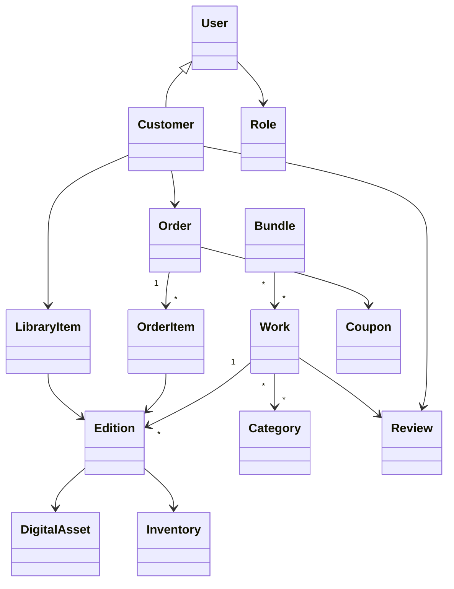
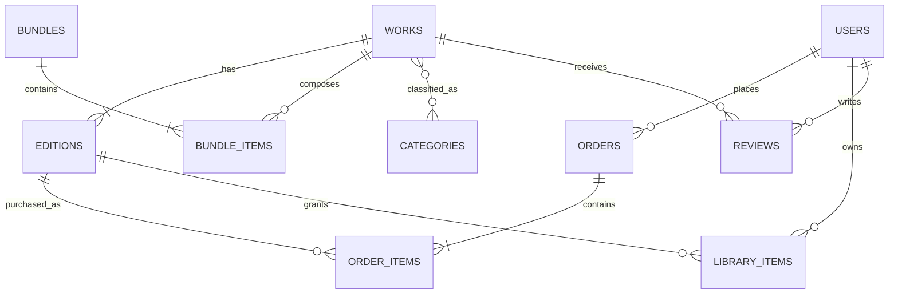
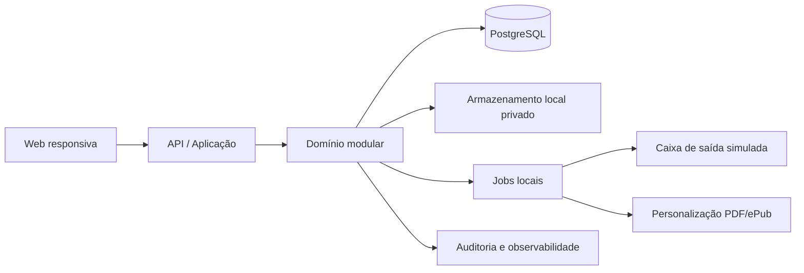

# Lumina Livros

**Versão:** 1.0
**Status:** PLANEJAMENTO APROVADO

## 1. Identificação e visão

Lumina Livros é uma aplicação web brasileira, responsiva, para descoberta e comercialização de livros físicos e e-books. Ela resolve a fragmentação entre catálogo, compra, entrega digital, estoque físico e operação administrativa.

O sistema oferece ao cliente busca, compra, lista de desejos, biblioteca digital, pedidos e avaliações; e à equipe interna catálogo, preços, cupons, estoque, logística, clientes e indicadores essenciais. O pagamento é deliberadamente fictício na V1: ao finalizar, o pedido pago é confirmado sem gateway externo.

## 2. Escopo da V1

- Cadastro, confirmação de e-mail, autenticação, recuperação de senha e perfil de cliente.
- Catálogo de obras com versões físicas/digitais, múltiplas categorias, busca e filtros.
- Carrinho, checkout, cupom global, frete simulado, pedido de valor zero e pagamento fictício.
- E-books individuais, gratuitos, bundles e pré-vendas; biblioteca, links temporários e marca d’água.
- Pedidos físicos, estoque, rastreio manual e estados de entrega.
- Wishlist, avaliações de compradores, denúncia e moderação administrativa.
- Painéis e indicadores essenciais para Administração Geral, Gestão de Catálogo e Estoquista.
- Notificações locais simuladas, auditoria de ações sensíveis e solicitação de exclusão de conta.

## 3. Fora de escopo

- Gateway de pagamento, emissão fiscal, antifraude e integração bancária.
- Transportadoras, cálculo real de frete e rastreamento externo.
- Leitor interno, DRM, aluguel, assinatura e alertas da wishlist.
- 2FA, exportação/portabilidade de dados, relatórios exportáveis/avançados e infraestrutura produtiva.
- Parecer ou certificação de conformidade legal; haverá preparação técnica para evolução e validação especializada.

## 4. Stakeholders e atores

| Ator | Responsabilidade e permissões principais |
|---|---|
| Visitante | Consultar catálogo e avaliações; criar conta ou autenticar-se. |
| Cliente | Comprar, usar cupom, manter wishlist, baixar e-books elegíveis, avaliar compras, consultar pedidos e solicitar exclusão. |
| Gestão de Catálogo | Gerir obras, versões, arquivos, preços, licenças, bundles, pré-vendas, cupons e visibilidade. |
| Estoquista | Gerir estoque físico, separação/envio/rastreio e relatórios de vendas físicas. |
| Administrador Geral | Acesso irrestrito, gestão de usuários, relatórios globais, moderação, reembolsos e acompanhamento de exclusões. |

Todos os perfis usam e-mail e senha; e-mail confirmado é pré-condição para ações autenticadas relevantes. Ações sensíveis exigem motivo e geram auditoria sem gravar valores pessoais em claro no log.

## 5. Requisitos funcionais

| ID | Requisito e aceitação resumida | Prioridade | Atores | RN / UC |
|---|---|---|---|---|
| RF-001 | Cadastrar, confirmar e-mail, autenticar e recuperar senha. Tokens expiram e não revelam existência de conta. | MUST | Cliente, equipe | RN-001; UC-001 |
| RF-002 | Manter perfil, histórico de compras e solicitação de exclusão. Solicitação desativa a conta e notifica cliente/admin. | MUST | Cliente, Admin | RN-016; UC-002 |
| RF-003 | Consultar catálogo e pesquisar por título ou autor; filtrar categoria, idioma, preço, mais vendidos, bem avaliados e lançamento. | MUST | Visitante, Cliente | RN-002; UC-003 |
| RF-004 | Exibir uma obra com metadados e versões físicas/digitais selecionáveis, cada uma com preço e disponibilidade próprios. | MUST | Visitante, Cliente | RN-003; UC-004 |
| RF-005 | Gestão de Catálogo cria/edita obras, múltiplas categorias, versões, capas, metadados, preço e visibilidade. ISBN deve ser válido. | MUST | Catálogo, Admin | RN-004; UC-005 |
| RF-006 | Gerir arquivos originais PDF/ePub e suas versões; publicação corrigida mantém histórico e atualiza biblioteca de adquirentes. | MUST | Catálogo, Admin | RN-005; UC-006 |
| RF-007 | Gerir disponibilidade: estoque físico numérico e licença digital numérica ou ilimitada. | MUST | Catálogo, Estoquista, Admin | RN-006; UC-007 |
| RF-008 | Adicionar/remover obras na wishlist pessoal. | SHOULD | Cliente | UC-008 |
| RF-009 | Manter carrinho com quantidades físicas; impedir recompra direta de e-book já possuído. | MUST | Cliente | RN-007; UC-009 |
| RF-010 | Aplicar no máximo um cupom global por pedido; validar tipo fixo/percentual, validade e cota de uso. | MUST | Cliente, Catálogo | RN-008; UC-010 |
| RF-011 | Calcular frete simulado por faixa de CEP e quantidade física, configurável pelo Admin, sem frete grátis. | MUST | Cliente, Admin | RN-009; UC-011 |
| RF-012 | Finalizar pedido híbrido, validar estoque/licenças atomicamente, confirmar pagamento fictício e registrar aquisição gratuita por R$ 0,00. | MUST | Cliente | RN-006, RN-010; UC-012 |
| RF-013 | Entregar e-books pagos/gratuitos na biblioteca; pré-venda só libera na data de lançamento. | MUST | Cliente | RN-011; UC-013 |
| RF-014 | Gerar download temporário autenticado, personalizado com nome, e-mail e ID de compra, sem expor o original. | MUST | Cliente | RN-005, RN-012; UC-014 |
| RF-015 | Criar bundles somente com livros existentes; impedir composição idêntica duplicada; liberar itens separadamente e ajustar preço por posse prévia. | MUST | Catálogo, Cliente | RN-013; UC-015 |
| RF-016 | Vender pré-vendas físicas e digitais e liberar/permitir expedição somente no lançamento. | MUST | Cliente, equipe | RN-014; UC-016 |
| RF-017 | Gerir pedido físico em `pago → em separação → enviado → entregue`, com rastreio manual. | MUST | Estoquista, Admin | RN-015; UC-017 |
| RF-018 | Cancelar/reembolsar conforme regras; automação válida para digital e decisão administrativa para físico. | MUST | Cliente, Admin | RN-016; UC-018 |
| RF-019 | Avaliar obra adquirida com 1–5 estrelas e comentário; publicar imediatamente; permitir denúncia e remoção administrativa. | SHOULD | Cliente, Admin | RN-017; UC-019 |
| RF-020 | Emitir e-mails simulados para confirmação, recuperação, compra, mudanças relevantes de pedido/conta, exclusão e correção de arquivo. | MUST | Sistema | RN-018; UC-020 |
| RF-021 | Exibir painéis: global, catálogo e físico, respeitando perfil. | MUST | Equipe | RN-019; UC-021 |
| RF-022 | Registrar auditoria de ações administrativas e sensíveis, incluindo ator, ação, alvo, data e motivo quando exigido. | MUST | Sistema, Admin | RN-020; UC-022 |
| RF-023 | Permitir gestão de usuários pelo Admin e acesso de cada papel apenas às ações autorizadas. | MUST | Admin | RN-021; UC-023 |

## 6. Requisitos não funcionais

| ID | Critério verificável |
|---|---|
| RNF-001 | Senhas com hash adaptativo; segredos fora do código; TLS obrigatório em produção. |
| RNF-002 | Autorização por papel e menor privilégio; testes cobrem acesso negado por papel. |
| RNF-003 | Dados pessoais minimizados, criptografados quando aplicável e não registrados em logs de auditoria. |
| RNF-004 | Páginas principais carregam em até 20 s em condições de referência a definir em PD-001. |
| RNF-005 | Interface responsiva em mobile/tablet/desktop e nas duas versões mais recentes de Chrome, Edge, Firefox e Safari. |
| RNF-006 | Meta WCAG 2.1 nível A: teclado, contraste, rótulos, mensagens de erro e texto alternativo. |
| RNF-007 | Backups diários criptografados; restauração testada periodicamente; indisponibilidade planejada inferior a 4 h/mês. |
| RNF-008 | Auditoria e monitoramento de erros sem conteúdo de credenciais, arquivos ou PII. |
| RNF-009 | Operações de checkout preservam consistência de estoque, licença, cupom e pedido sob concorrência. |
| RNF-010 | Originais e downloads não podem ser públicos; links são temporários e autenticados. |
| RNF-011 | APIs usam validação de entrada, respostas de erro consistentes, paginação e proteção contra abuso. |
| RNF-012 | Módulos em camadas, contratos testáveis e cobertura de testes proporcional a risco. |

## 7. Regras de negócio

| ID | Regra |
|---|---|
| RN-001 | E-mail confirmado é obrigatório para comprar, baixar, avaliar e operar perfis internos. |
| RN-002 | Obras possuem título, autor, editora, sinopse, capa, categorias, ISBN válido, idioma, lançamento e edição; uma obra pode ter várias categorias. |
| RN-003 | Uma obra pode ter versões física/digital com preço, ISBN, estoque/licença e disponibilidade independentes. Ocultar não remove acesso de quem já adquiriu. |
| RN-004 | Estoque/licença é validado e consumido somente no checkout confirmado; falta no instante impede pedido. |
| RN-005 | E-book não é recomprável diretamente; bundles podem conter item já possuído, mas não são compráveis se todos já forem possuídos. |
| RN-006 | Bundle é formado apenas por obras existentes e não pode repetir composição idêntica com preço diferente. |
| RN-007 | Preço de bundle = preço próprio − soma dos preços individuais vigentes dos e-books já possuídos, limitado a zero; cupom incide após esse ajuste. |
| RN-008 | Cupom global é fixo ou percentual, tem validade e máximo de usos, não possui mínimo/máximo de compra e há somente um por pedido. |
| RN-009 | Frete aplica-se apenas a itens físicos, por faixa de CEP e quantidade; não há frete grátis. |
| RN-010 | Checkout de físico exige nome, CPF válido, telefone e endereço brasileiro completo. Pedido híbrido é único; digital é liberado de forma independente. |
| RN-011 | Pedido de R$ 0,00 passa pelo carrinho e é confirmado sem pagamento; carrinho com item pago usa confirmação fictícia. |
| RN-012 | Pré-venda é cobrada/confirmada na compra; download e expedição física só ocorrem no lançamento. |
| RN-013 | Pré-venda pode ser cancelada até uma semana antes do lançamento. |
| RN-014 | E-book é reembolsável automaticamente até 2 h após gerar o link ou até 2 semanas da compra sem download; Admin pode reembolsar excepcionalmente. |
| RN-015 | Físico só pode ser cancelado antes de enviado; reembolso físico é decidido pelo Admin. |
| RN-016 | Avaliação exige aquisição da obra; qualquer usuário pode denunciar; Admin pode removê-la com motivo/auditoria. |
| RN-017 | Ações sensíveis devem ser auditadas sem copiar dados pessoais explícitos. |

## 8. Casos de uso

| UC | Objetivo, fluxo principal e exceções | RF |
|---|---|---|
| UC-001 | Criar/confirmar conta ou recuperar acesso; token inválido/expirado não confirma. | RF-001 |
| UC-003 | Pesquisar e filtrar catálogo; filtros sem resultado preservam critérios e informam vazio. | RF-003–004 |
| UC-005 | Cadastrar obra e versões; metadado/ISBN/arquivo inválido impede publicação. | RF-005–007 |
| UC-009 | Montar carrinho; e-book já possuído e quantidade indisponível são recusados. | RF-009 |
| UC-012 | Finalizar pedido; valida cupom, endereço, frete e estoque/licença em transação; falha não cria pedido. | RF-010–012 |
| UC-014 | Solicitar download; valida aquisição e lançamento, gera cópia personalizada e link temporário. | RF-013–014 |
| UC-015 | Comprar bundle; calcula posse prévia e bloqueia bundle integralmente possuído. | RF-015 |
| UC-017 | Atualizar expedição física; transições inválidas e pré-venda anterior ao lançamento são recusadas. | RF-017 |
| UC-018 | Solicitar/realizar cancelamento ou reembolso; regras de janela definem automático, análise ou recusa. | RF-018 |
| UC-019 | Avaliar/denunciar/moderar; somente comprador avalia e moderação é auditada. | RF-019, RF-022 |
| UC-021 | Consultar painel conforme papel; métricas não autorizadas são negadas. | RF-021, RF-023 |

## 9. Modelo conceitual do domínio

Agregados: **Obra** (metadados e edições), **Pedido** (itens, totais, cupom e transições), **Bundle** (composição única), e **Biblioteca** (direitos de acesso). Valores monetários usam decimal/moeda BRL; endereço é valor imutável armazenado no pedido.

## 10. Modelo inicial de dados

Entidades principais: `users`, `roles`, `user_roles`, `email_tokens`, `password_reset_tokens`, `account_deletion_requests`, `works`, `authors`, `publishers`, `categories`, `work_categories`, `editions`, `digital_assets`, `digital_asset_versions`, `inventory_movements`, `bundles`, `bundle_items`, `coupons`, `coupon_redemptions`, `carts`, `cart_items`, `shipping_rules`, `orders`, `order_items`, `shipping_addresses`, `library_items`, `download_events`, `reviews`, `review_reports`, `notifications`, `audit_logs`.

Índices relevantes: e-mail normalizado único; ISBN por edição; busca por título/autor; estado/data de pedido; disponibilidade; cupom/cota; chave canônica de composição de bundle; unicidade de biblioteca por cliente/edição. Todas as entidades mutáveis recebem identificador, criação, atualização e autoria quando aplicável.

## 11. Arquitetura proposta

Arquitetura em camadas, monólito modular: interface web, API de aplicação, domínio e infraestrutura. Módulos: identidade, catálogo, comércio, biblioteca, logística, avaliações, notificações, relatórios e auditoria. Inicialmente, tarefas de e-mail e personalização de arquivo podem ser processadas localmente com estado observável; o contrato deve permitir fila/objeto privado posterior.

Erros de validação retornam problema padronizado; falhas de negócio não expõem detalhes internos. Checkout usa transação e bloqueio/concorrência apropriado para evitar sobre-venda.

## 12. APIs planejadas

| Método e rota | Finalidade / autorizado | RF |
|---|---|---|
| `POST /auth/register`, `/verify-email`, `/login`, `/password-reset/*` | Identidade pública autenticada | RF-001 |
| `GET /works`, `GET /works/{slug}` | Catálogo e filtros públicos | RF-003–004 |
| `POST/PUT /admin/works`, `/editions`, `/assets`, `/bundles`, `/coupons` | Gestão de catálogo/Admin | RF-005–007,015 |
| `GET/POST/DELETE /wishlist` | Wishlist do cliente | RF-008 |
| `GET/POST/PATCH /cart` | Carrinho do cliente | RF-009–011 |
| `POST /checkout`, `GET /orders/{id}` | Pedido e confirmação fictícia | RF-012 |
| `GET /library`, `POST /library/{id}/download` | Biblioteca e link temporário | RF-013–014 |
| `PATCH /inventory`, `PATCH /orders/{id}/shipping` | Estoque/expedição autorizados | RF-007,017 |
| `POST /orders/{id}/cancel`, `/refund` | Cancelamento e reembolso | RF-018 |
| `POST /works/{id}/reviews`, `POST /reviews/{id}/reports`, `DELETE /admin/reviews/{id}` | Avaliação/moderação | RF-019 |
| `GET /admin/dashboard`, `/catalog/dashboard`, `/warehouse/dashboard` | Indicadores por papel | RF-021 |

Entradas são validadas, toda rota autenticada verifica papel e rotas administrativas sensíveis exigem `reason`. Códigos principais: 200/201, 400, 401, 403, 404, 409 para conflito de estoque/posse, 422 para regra de negócio e 429 para abuso.

## 13. Tecnologias sugeridas

A decisão final está em ADRs. Recomendação inicial: Next.js/React para interface, NestJS/TypeScript para API em camadas, PostgreSQL para transações, ORM com migrações controladas, armazenamento privado abstrato e fila substituível. Alternativas consideradas: Java/Spring, .NET, Django; cada uma é viável, mas TypeScript ponta a ponta reduz atrito para um MVP com contratos compartilháveis. Nenhuma dependência será instalada nesta etapa.

## 14. Estratégia de segurança e privacidade

Aplicar OWASP ASVS proporcionalmente: hash de senha, cookies/sessão seguros, expiração e uso único de tokens, RBAC, rate limiting, CSRF conforme arquitetura, validação/sanitização, proteção contra enumeração, logs estruturados e controle de segredo. CPF/endereço são acessíveis apenas quando necessários. Solicitação de exclusão desativa a conta; prazo/eliminação definitiva requer política jurídica futura.

## 15. Estratégia de testes

Testes: unidade para domínio e regras; integração para persistência, transações e autorização; API para contratos; E2E para compra digital/física e administração; segurança para papéis/tokens; acessibilidade automatizada e manual; carga básica para catálogo/checkout. Cada TASK define os testes específicos.

## 16. Riscos

| Risco | Prob./impacto | Mitigação |
|---|---|---|
| Regras de consumo/LGPD incompletas | Média/Alta | PD-002, revisão jurídica antes de produção. |
| Marca d’água em ePub/PDF complexa | Média/Alta | Adaptador, arquivos de teste e validação antes de publicação. |
| Sobre-venda concorrente | Média/Alta | Transação, índices e testes de concorrência. |
| Escala desconhecida | Média/Média | PD-001, métricas e arquitetura modular. |
| Simulações divergirem de integrações reais | Alta/Média | Interfaces explícitas e testes de contrato. |

## 17. Roadmap

| Fase | Objetivo / conclusão |
|---|---|
| PHASE-01 | Base, convenções, identidade e segurança mínima; build/testes base passam. |
| PHASE-02 | Catálogo, inventário, busca e administração editorial prontos. |
| PHASE-03 | Carrinho, checkout, cupom, frete e pedido transacional prontos. |
| PHASE-04 | Biblioteca, downloads, bundles, pré-vendas e reembolso prontos. |
| PHASE-05 | Logística física, avaliações, painéis, privacidade e endurecimento concluídos. |

## 18. Matriz de rastreabilidade

| RF | RN | RNF | UC | Entidade/API | TASK |
|---|---|---|---|---|---|
| RF-001–002 | RN-001 | 001–003 | UC-001–002 | users/auth | TASK-003–005 |
| RF-003–007 | RN-002–006 | 009–012 | UC-003–007 | works/editions | TASK-007–010 |
| RF-009–012 | RN-007–011 | 009 | UC-009–012 | cart/orders | TASK-012–015 |
| RF-013–016 | RN-012–014 | 010 | UC-013–016 | library/bundles | TASK-017–020 |
| RF-017–023 | RN-015–017 | 002–008 | UC-017–023 | logistics/reviews/audit | TASK-021–026 |

## 19. Pendências

| ID | Descrição / impacto / condição |
|---|---|
| PD-001 | Escala esperada. Afeta capacidade e metas de desempenho; resolver antes de produção. |
| PD-002 | Política jurídica de retenção/exclusão. Afeta privacidade e operação; requer revisão especializada. |
| PD-003 | Provedor de hospedagem, e-mail e armazenamento. Afeta implantação; fora da V1 local. |
