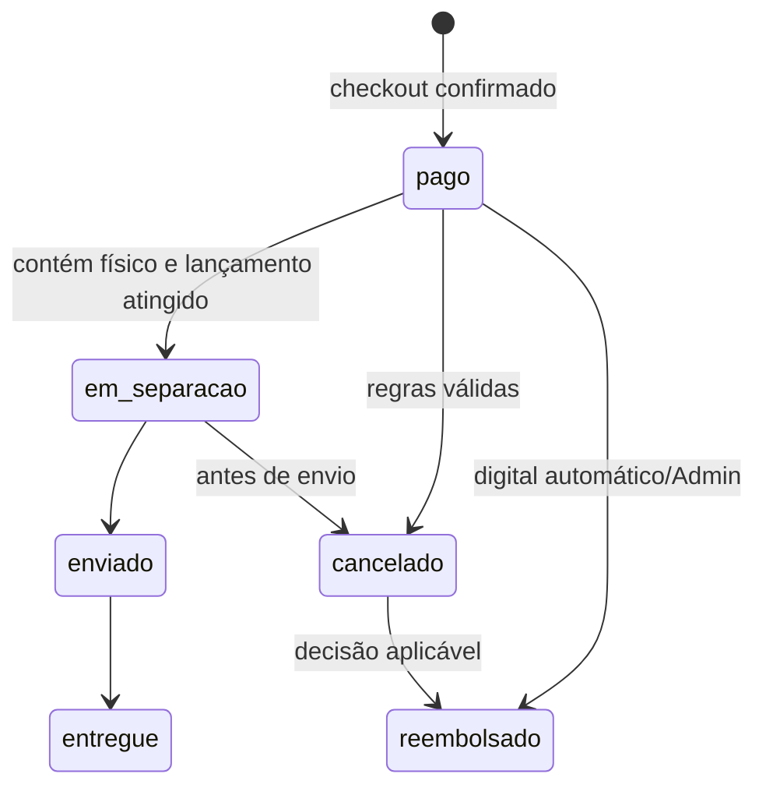

# Arquitetura detalhada

## Limites de módulos

| Módulo | Responsabilidade | Não deve conhecer diretamente |
|---|---|---|
| Identity | usuário, sessão, confirmação, RBAC e exclusão solicitada | regras de preço/pedido |
| Catalog | obra, edição, metadados, categorias, preço, visibilidade e ativos | carrinho e direitos de biblioteca |
| Inventory | estoque físico, licença digital e movimentos | UI e e-mail |
| Commerce | carrinho, cupom, frete, pedido, pagamento simulado e totais | mecanismo de arquivo |
| Library | concessão, pré-venda, download e eventos de acesso | preço/cupom |
| Logistics | separação, envio, entrega e rastreio físico | catálogo/preço |
| Reviews | avaliações, denúncias e moderação | autorização fora do contrato Identity |
| Notifications | eventos e caixa de saída simulada | detalhes internos de origem |
| Reporting | leituras agregadas por papel | operações de escrita de domínio |
| Audit | registro mínimo de ação sensível | dados pessoais/conteúdo de arquivo |

## Fluxo transacional de checkout

1. A aplicação recalcula carrinho e cupom no servidor.
2. Para item físico, valida CPF/endereço, faixa de CEP e frete.
3. Em uma transação, bloqueia/valida inventário e licenças, verifica posse digital e cota do cupom.
4. Cria pedido e itens, consome recursos, confirma pagamento simulado (ou dispensa se total R$ 0,00) e registra direitos digitais elegíveis.
5. Após commit, publica eventos para notificação, biblioteca/preorder e auditoria. Falha antes do commit não deixa pedido nem consumo parcial.

## Estados de pedido

E-books não exigem estado logístico. Pré-vendas preservam o pedido `pago`, mas bloqueiam direito de download/expedição até a data de lançamento.

## Segurança de arquivos

O adaptador de armazenamento oferece operações `storeOriginal`, `getOriginalForProcessing`, `storePersonalizedCopy` e `issueTemporaryDownload`. Nenhuma rota retorna caminho do original. A cópia individual inclui nome, e-mail e ID de compra; o evento de geração/início de download sustenta a regra de reembolso.

## Evolução de infraestrutura

A V1 usa adaptadores locais simulados. Produção substitui implementação, não domínio: armazenamento privado S3 compatível, fila gerenciada, serviço de e-mail e observabilidade centralizada. A substituição exige ADR e testes de contrato; não é parte da V1.

## Recuperação

Backups diários criptografados incluem banco e metadados necessários. A restauração periódica deve verificar integridade, autorização e capacidade de reconstruir referências de arquivo; o conteúdo original exige política de backup definida antes de produção (PD-003).
