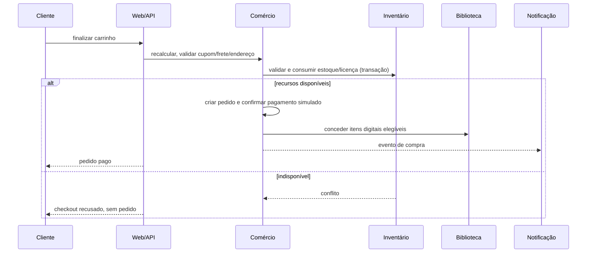

# Sequência de compra

```mermaid
sequenceDiagram
  participant C as Cliente
  participant W as Web/API
  participant O as Comércio
  participant I as Inventário
  participant L as Biblioteca
  participant N as Notificação
  C->>W: finalizar carrinho
  W->>O: recalcular, validar cupom/frete/endereço
  O->>I: validar e consumir estoque/licença (transação)
  alt recursos disponíveis
    O->>O: criar pedido e confirmar pagamento simulado
    O->>L: conceder itens digitais elegíveis
    O-->>N: evento de compra
    W-->>C: pedido pago
  else indisponível
    I-->>O: conflito
    W-->>C: checkout recusado, sem pedido
  end
```
