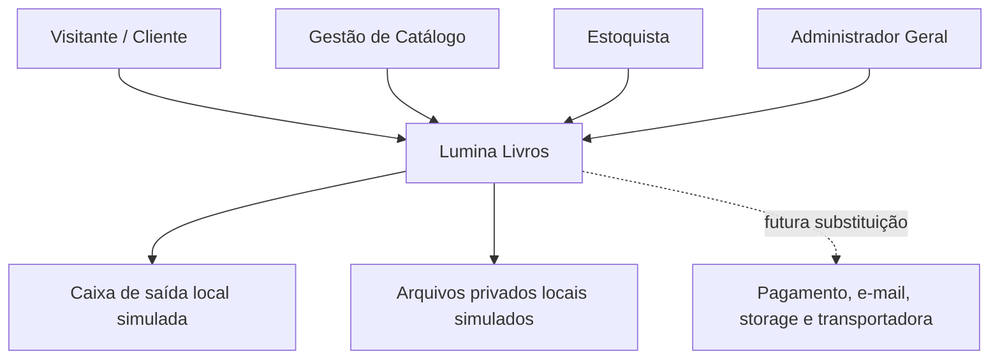

# Contexto

```mermaid
flowchart TB
  Visitor[Visitante / Cliente] --> Lumina[Lumina Livros]
  Catalog[Gestão de Catálogo] --> Lumina
  Warehouse[Estoquista] --> Lumina
  Admin[Administrador Geral] --> Lumina
  Lumina --> LocalMail[Caixa de saída local simulada]
  Lumina --> LocalFiles[Arquivos privados locais simulados]
  Lumina -. futura substituição .-> External[Pagamento, e-mail, storage e transportadora]
```
