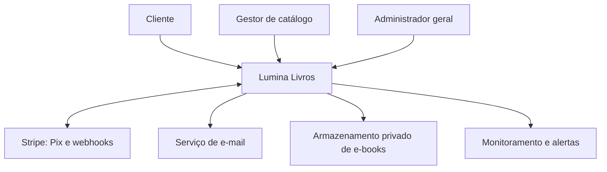

# Contexto do sistema

```mermaid
flowchart TB
  Reader[Cliente] --> Lumina[Lumina Livros]
  Manager[Gestor de catálogo] --> Lumina
  Admin[Administrador geral] --> Lumina
  Lumina <--> Stripe[Stripe: Pix e webhooks]
  Lumina --> Mail[Serviço de e-mail]
  Lumina --> Storage[Armazenamento privado de e-books]
  Lumina --> Monitor[Monitoramento e alertas]
```
