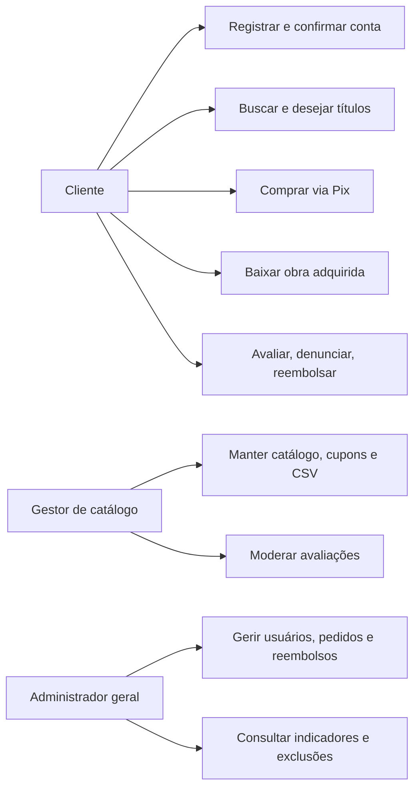

# Casos de uso essenciais

```mermaid
flowchart LR
  C[Cliente] --> U1[Registrar e confirmar conta]
  C --> U2[Buscar e desejar títulos]
  C --> U3[Comprar via Pix]
  C --> U4[Baixar obra adquirida]
  C --> U5[Avaliar, denunciar, reembolsar]
  G[Gestor de catálogo] --> A1[Manter catálogo, cupons e CSV]
  G --> A2[Moderar avaliações]
  A[Administrador geral] --> A3[Gerir usuários, pedidos e reembolsos]
  A --> A4[Consultar indicadores e exclusões]
```
