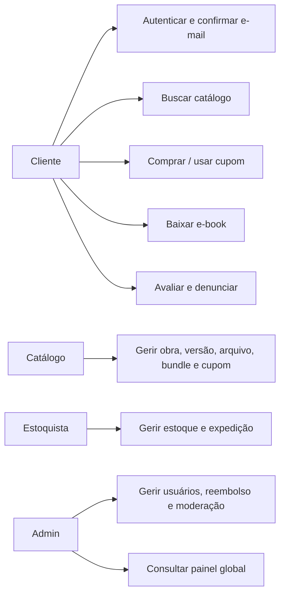

# Casos de uso essenciais

```mermaid
flowchart LR
  C[Cliente] --> A[Autenticar e confirmar e-mail]
  C --> B[Buscar catálogo]
  C --> D[Comprar / usar cupom]
  C --> E[Baixar e-book]
  C --> F[Avaliar e denunciar]
  G[Catálogo] --> H[Gerir obra, versão, arquivo, bundle e cupom]
  W[Estoquista] --> I[Gerir estoque e expedição]
  X[Admin] --> J[Gerir usuários, reembolso e moderação]
  X --> K[Consultar painel global]
```
